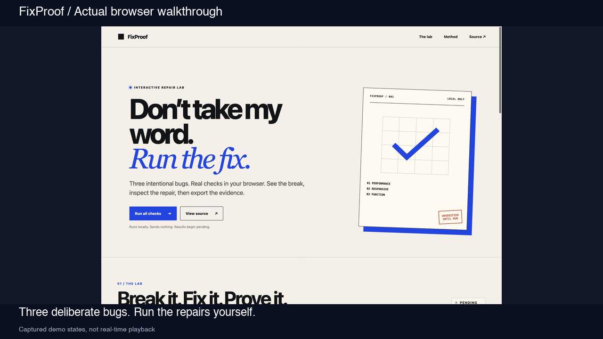

# FixProof

**[Run the interactive demo](https://dresecuri-lee.github.io/fixproof/) | [Repair your page](https://dresecuri-lee.github.io/fixproof/repair.html) | [Watch the 20-second tour](https://dresecuri-lee.github.io/fixproof/media/fixproof-walkthrough.mp4) | [Inspect a real browser report](evidence/browser-run.json)**

Don't take my word. Run the fix.

[](https://dresecuri-lee.github.io/fixproof/)

The video combines actual captured demo states, with captions. It is not real-time benchmark playback.

FixProof is a dependency-free static portfolio app for demonstrating small web repairs with browser-observed evidence. It contains three original synthetic cases: an over-rendered 6,000-item catalog, a 390px mobile overflow, and a local form with a dead button. The separate **Repair your page** tool accepts local HTML/CSS and measures a sanitized copy at four widths.

The before states are intentionally broken only inside their previews. No client work, customer data, external assets, analytics, or network form submission is included.

Have a small website issue? [Send the bug, budget and deadline on X](https://x.com/bedi_samir53094). Please share public details only in GitHub issues.

The checked-in browser report is one observed run, not a performance guarantee. The live app always starts pending and measures again on your device.

## Run locally

Requirements: Python 3 and Node.js 20 or newer.

```bash
python3 -m http.server 3020 --bind 127.0.0.1
```

Open `http://127.0.0.1:3020/`, select any case, or choose **Run all checks**.

For your own layout, open `http://127.0.0.1:3020/repair.html`, load the broken example or paste HTML/CSS, then choose **Analyze layout**. Nothing renders until you choose Analyze. The file picker accepts one `.html` file; CSS is entered in the CSS editor.

Tests and syntax checks:

```bash
node --test
npm run check
```

## 한국어 빠른 시작

이 저장소에서 `python3 -m http.server 3020 --bind 127.0.0.1`을 실행하고 브라우저에서 `http://127.0.0.1:3020/repair.html`을 엽니다. **Load broken example**을 누른 뒤 **Analyze layout**을 선택하면 320, 390, 768, 1280px에서 실제 렌더링 폭을 확인할 수 있습니다. HTML을 붙여 넣거나 `.html` 파일을 선택하고 CSS를 추가할 수도 있습니다. 긴 제목 스트레스 테스트는 원문을 합성 문구로 바꾸므로 결과에 표시되고 파일명에도 구분됩니다. 기존 세 데모는 첫 화면의 **Run all checks**에서 실행합니다.

## Responsive repair tool

The tool rebuilds an allowlisted structural HTML subset in an inert template. It removes scripts, event handlers, links, forms, frames, media, SVG, custom elements, and resource-bearing attributes. It strips CSS imports; its sandbox and CSP block external resource requests. Inline style and remaining author CSS are retained for layout inspection. The preview can differ substantially from the source site. It is not a URL importer or a complete adversarial browser isolation guarantee.

Analysis runs each of four CSS viewport widths in an isolated sandbox frame. It reports the rendered document width and elements causing overflow. Supported patches target stable tool IDs for observed fixed pixel width or long unbroken text. Absolute positioning, complex grids, transformed layouts, and other causes remain unresolved unless the remeasurement actually fits. The tool never treats hidden overflow as a repair.

Before and Patched previews use the same sanitized markup and CSS as measurement. The selectable width and slider set the frames' CSS viewport, then scale the display to fit. The table contains only the four measured widths. Editing either editor or changing stress mode invalidates results and disables downloads until the next completed scan.

Downloads include a standalone **sanitized layout copy** with a strict CSP and no scripts, the exact CSS patch, and a JSON report containing the sanitized markup/CSS, removal counts, stress mode, all measured widths, and limitations. The exports are a local starting point for review, not a claim that the original site is fully preserved. Max input sizes are 200 KB HTML, 100 KB combined CSS, and 1,500 HTML elements. No input is persisted or sent to this project's services.

## What each case proves

- **Heavy page:** both variants share one deterministic 6,000-item catalog and search function. The before fixture mounts all matching cards. The fixed fixture reports the same match count and visible label order while mounting only 18 cards. The check compares the rendered fixture DOM, not only catalog data.
- **Mobile overflow:** the browser measures `scrollWidth` and `clientWidth` on the same 390px fixture markup used by the previews. The before content is 520px wide; the fixed content resolves to its viewport. The preview is displayed at reduced scale, while its CSS viewport remains 390px.
- **Dead button:** browser checks click the actual local fixture. The before button has no handler. The fixed button rejects empty input and confirms valid input without a request.

## Evidence report

Results are pending on load. A report becomes available only after a real run. It contains:

- all individual timing samples and their median;
- DOM card counts and catalog sample count;
- before-bug and fixed-pass assertions for every case;
- rendered overflow dimensions and actual form messages;
- user agent, language, viewport, fixture version, and timestamp.

The Heavy page result area also shows the last run's Before and Fixed median DOM update and frame-aligned elapsed times. It stays Pending until measured and never calculates a claimed improvement percentage.

Heavy-page timing uses `performance.now()` around DOM creation and insertion in a hidden measurement container. `domUpdateMs` ends after insertion. `frameAlignedElapsedMs` ends after two animation-frame callbacks; it is not an authoritative paint-completion measurement. The report includes `medianDomUpdateMs` and `medianFrameAlignedElapsedMs` plus five raw samples in alternating before/fixed order. These are synthetic fixture measurements, not Lighthouse scores or Web Vitals. Timings vary with browser, hardware, extensions, tab visibility, and current device load. A slower fixed timing is reported as observed; the repair assertion is based on bounded DOM and rendered search parity, not a promised speedup.

The exported JSON schema is represented by the report object produced in `app.js`. A report is internally consistent when `validateEvidenceReport` in `core.js` accepts its fixture version, environment, three findings, timing block, and derived status.

## Static deployment

Everything is served directly from the repository root with relative asset paths, so the same files work at `/fixproof/` on GitHub Pages.

1. Publish this directory as the root of the `dresecuri-lee/fixproof` repository.
2. In repository settings, choose **Pages**, **Deploy from a branch**, `main`, and `/ (root)`.
3. The expected public URL is `https://dresecuri-lee.github.io/fixproof/`.

There is no build step and no runtime dependency. After the first load, the app itself needs no external font, image, API, or service.

## Credits

The fixtures and interface are original and synthetic. The project was built with AI assistance and is intended to be reviewed through its source, automated tests, and real browser run rather than by unchecked claims.
